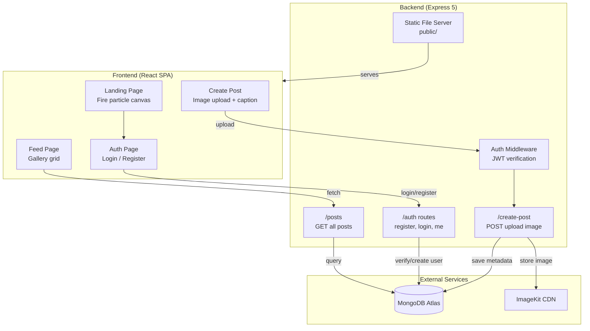

<div align="center">


<br/>


<br/><br/>

[](https://react.dev/)
[](https://expressjs.com/)
[](https://www.mongodb.com/atlas)
[](https://imagekit.io/)
[](#-license)

<br/>

[**🔗 Live Demo**](https://cloudsnap-x107.onrender.com) &nbsp;·&nbsp; [**🐞 Report Bug**](../../issues) &nbsp;·&nbsp; [**✨ Request Feature**](../../issues)

</div>


<br/>

## 📖 Table of Contents

<table>
<tr>
<td valign="top" width="33%">

- [About](#-about)
- [Features](#-features)
- [Tech Stack](#️-tech-stack)
- [Architecture](#️-architecture)

</td>
<td valign="top" width="33%">

- [Folder Structure](#-folder-structure)
- [API Reference](#-api-reference)
- [Getting Started](#-getting-started)
- [Environment Variables](#-environment-variables)

</td>
<td valign="top" width="33%">

- [Deployment](#️-deployment-render)
- [Roadmap](#️-roadmap)
- [Contributing](#-contributing)
- [License](#-license)

</td>
</tr>
</table>

<br/>

## 🌩️ About

<table>
<tr>
<td width="60%" valign="top">

**CloudSnap** is a full-stack image-sharing platform — register, log in, drag-and-drop an image with a caption, and watch it land in a shared gallery feed seconds later, served off a real CDN instead of local disk.

Every image goes through **ImageKit**, every session is backed by a signed **JWT**, and every post lives in **MongoDB** — this isn't a UI mockup wired to dummy data, it's a working production stack.

The landing page is the calling card: a full-screen fire hero with a real-time canvas particle system, no video file, no GIF — just math, running at 60fps.

```ts
const cloudsnap = {
  type: "full-stack image sharing platform",
  storage: "ImageKit CDN",
  auth: "JWT + bcrypt",
  database: "MongoDB Atlas",
  signature: "real-time canvas fire particles, ~180 of them",
};
```

</td>
<td width="40%" valign="top">

### ⚡ At a Glance

| | |
|---|---|
| 🧱 Stack | MERN + CDN |
| 🔐 Auth | JWT, 7-day expiry |
| ☁️ Storage | ImageKit |
| 🚀 Deploy | Render (single service) |
| 🔥 Signature | Live canvas fire particles |
| 🌐 Live | [cloudsnap-x107.onrender.com](https://cloudsnap-x107.onrender.com) |

</td>
</tr>
</table>

> [!NOTE]
> Hosted on Render's free tier — the server can spin down during inactivity, so the first load after idle time may take 30–60 seconds while it wakes back up.

<br/>

## ✨ Features

<table>
<tr>
<td width="50%" valign="top">

### 🔐 Authentication
- Register with full name, email, password — bcrypt-hashed, 6+ char minimum
- Login returns a JWT token (7-day expiry)
- Session auto-restore via `/auth/me` on page load
- Protected routes guard the Feed and Upload pages

### 📸 Image Upload
- Drag-and-drop or click-to-browse upload
- Live image preview before submission
- Caption input with a 200-character counter
- Images sent as base64 to ImageKit, served via CDN URL
- Toast notifications for upload progress / success / failure

</td>
<td width="50%" valign="top">

### 🖼️ Gallery Feed
- Responsive grid layout of every post
- Cards show image, caption, author avatar, "Cloud stored" badge
- Animated like / toggle button
- Loading skeletons + empty-state CTA

### 🔥 Landing Page
- Full-screen hero with custom FIREEYE background
- Real-time canvas particle system — ~150 flame + 30 ember particles
- Particle count scales responsively for mobile vs. desktop
- Glassmorphism navbar with live user avatar when signed in

</td>
</tr>
</table>

<br/>

## 🛠️ Tech Stack

<div align="center">


</div>

| Layer | Technology | Purpose |
|---|---|---|
| **Frontend** | React 19 + Vite 7 | SPA with client-side routing |
| **Styling** | Vanilla CSS | Dark theme, glassmorphism, gradients, animations |
| **Routing** | React Router v7 | Client-side navigation (`/`, `/auth`, `/feed`, `/create-post`) |
| **HTTP Client** | Axios | API requests to backend |
| **Backend** | Express 5 (Node.js) | REST API server |
| **Database** | MongoDB (Mongoose 9) | User accounts & post metadata |
| **Image Storage** | ImageKit SDK | Cloud image upload & CDN delivery |
| **Auth** | JWT + bcryptjs | Token-based authentication with password hashing |
| **File Upload** | Multer | Multipart form handling |
| **Deployment** | Render | Single web service serving frontend + backend |

<br/>

## 🏗️ Architecture



<br/>

## 📁 Folder Structure

<details>
<summary><strong>Click to expand full project tree</strong></summary>

```
cloudsnap/
├── Backend/
│   ├── server.js                    # Entry point — starts Express & connects DB
│   ├── package.json                 # Backend dependencies & start script
│   ├── .env                         # Environment variables (not committed)
│   ├── public/                      # Built frontend assets (auto-generated)
│   │   ├── index.html
│   │   ├── vite.svg
│   │   └── assets/
│   │       ├── index-*.js           # Bundled React app
│   │       ├── index-*.css          # Bundled styles
│   │       └── FIREEYE-*.png        # Hero background image
│   └── src/
│       ├── app.js                   # Express app config, routes, static serving
│       ├── db/
│       │   └── db.js                # MongoDB connection
│       ├── middleware/
│       │   └── auth.middleware.js   # JWT token verification
│       ├── models/
│       │   ├── user.model.js        # User schema (fullName, email, password)
│       │   └── post.model.js        # Post schema (image URL, caption, user ref)
│       ├── routes/
│       │   └── auth.routes.js       # /auth/register, /auth/login, /auth/me
│       └── services/
│           └── storage.service.js   # ImageKit upload logic
│
├── Frontend/
│   ├── index.html                   # Vite entry HTML
│   ├── vite.config.js               # Vite config with dev proxy
│   ├── package.json                 # Frontend dependencies & build script
│   ├── public/
│   │   └── vite.svg
│   ├── dist/                        # Build output (auto-generated)
│   └── src/
│       ├── main.jsx                 # React root mount
│       ├── App.jsx                  # Router setup & page layout
│       ├── index.css                # Full app styles (~48KB)
│       ├── context/
│       │   └── AuthContext.jsx      # Auth state management (login, register, logout)
│       ├── components/
│       │   ├── Navbar.jsx           # Top navigation bar
│       │   ├── ProtectedRoute.jsx   # Auth guard component
│       │   └── FireBackground.jsx   # Reusable canvas fire particle effect
│       ├── pages/
│       │   ├── LandingPage.jsx      # Hero page with fire animation (~520 lines)
│       │   ├── AuthPage.jsx         # Login/Register with tab switching
│       │   ├── CreatePost.jsx       # Drag & drop image upload form
│       │   └── Feed.jsx             # Gallery grid with like buttons
│       └── images/
│           └── FIREEYE.png          # Hero background image asset
│
├── scripts/
│   └── copy-build.js                # Cross-platform build copy script
│
└── package.json                     # Root orchestration scripts
```

</details>

<br/>

## 🔌 API Reference

| Method | Endpoint | Auth Required | Description |
|---|---|:---:|---|
| `POST` | `/auth/register` | ✗ | Create a new user account |
| `POST` | `/auth/login` | ✗ | Login and receive a JWT token |
| `GET` | `/auth/me` | ✓ | Get the current user from token |
| `POST` | `/create-post` | ✓ | Upload an image + caption (multipart) |
| `GET` | `/posts` | ✗ | Fetch all posts with user info |

<br/>

## 🚀 Getting Started

### Prerequisites
- [Node.js](https://nodejs.org/) ≥ 18
- A [MongoDB Atlas](https://www.mongodb.com/atlas) cluster (or local MongoDB instance)
- An [ImageKit](https://imagekit.io/) account for image storage/CDN

### Installation

```bash
# Clone the repo
git clone https://github.com/<your-username>/cloudsnap.git
cd cloudsnap

# 1. Install backend dependencies
cd Backend && npm install

# 2. Install frontend dependencies
cd ../Frontend && npm install
```

### Running Locally

```bash
# Terminal 1 — start the backend
cd Backend && npm start

# Terminal 2 — start the frontend dev server
cd Frontend && npm run dev
```

| Service | URL |
|---|---|
| Frontend (dev) | `http://localhost:5173` *(proxies API to `:3000`)* |
| Backend | `http://localhost:3000` |

<br/>

## 🔑 Environment Variables

Create a `.env` file inside `Backend/` with the following:

```env
MONGO_URI=mongodb+srv://<user>:<pass>@<cluster>.mongodb.net/<dbname>
JWT_SECRET=your_jwt_secret_key
IMAGEKIT_PUBLIC_KEY=your_imagekit_public_key
IMAGEKIT_PRIVATE_KEY=your_imagekit_private_key
IMAGEKIT_URL_ENDPOINT=https://ik.imagekit.io/your_endpoint
```

> [!CAUTION]
> Never commit your `.env` file to version control. Make sure it's listed in `.gitignore`.

<br/>

## ☁️ Deployment (Render)

> Currently live at **[cloudsnap-x107.onrender.com](https://cloudsnap-x107.onrender.com)**

### Option A — Deploy Backend Only *(Recommended)*

1. Push the project to GitHub as `cloudsnap`.
2. On Render, create a **Web Service**.
3. Configure:

   | Setting | Value |
   |---|---|
   | Root Directory | `Backend` |
   | Build Command | `npm install` |
   | Start Command | `npm start` |
   | Environment | Add all 5 variables from `.env` |

4. Before deploying, run `npm run build` from the project root so `Backend/public/` contains the latest frontend build.
5. Commit the `Backend/public/` folder to Git.

### Option B — Auto-Build Frontend on Render

   | Setting | Value |
   |---|---|
   | Root Directory | *(leave empty / project root)* |
   | Build Command | `cd Frontend && npm install && cd ../Backend && npm install && cd .. && npm run build` |
   | Start Command | `npm start` |

<br/>

## 🗺️ Roadmap

- [ ] Comments on posts
- [ ] User profile pages
- [ ] Image search & tagging
- [ ] Infinite scroll for the feed
- [ ] Dark/light theme toggle

Feel free to open an issue to suggest more!

<br/>

## 🤝 Contributing

Contributions are welcome!

1. Fork the repo
2. Create your feature branch — `git checkout -b feature/amazing-feature`
3. Commit your changes — `git commit -m 'Add amazing feature'`
4. Push to the branch — `git push origin feature/amazing-feature`
5. Open a Pull Request

<br/>

## 📄 License

Distributed under the MIT License. See `LICENSE` for more information.

<br/>


<div align="center">

Built with 🔥 using React, Express, MongoDB &amp; ImageKit.


</div>
