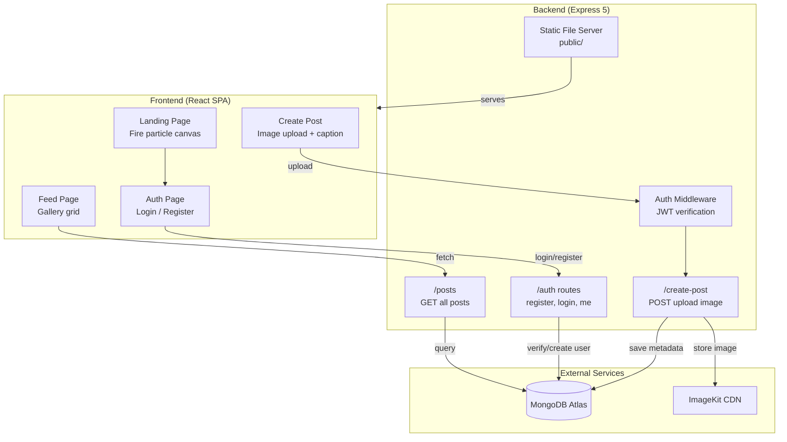

# ☁️ CloudSnap — Project Overview

## Suggested Repo Name

> **`cloudsnap`**

Other options if that's taken:
- `cloudsnap-gallery`
- `cloudsnap-app`
- `cloudsnap-imagekit`

---

## What is CloudSnap?

**CloudSnap** is a full-stack image sharing web application where users can register, log in, upload images with captions, and browse a shared gallery. All images are stored in the cloud via **ImageKit CDN**, ensuring fast global delivery. The app features a stunning fire-themed landing page with real-time canvas particle animations.

---

## Tech Stack

| Layer | Technology | Purpose |
|-------|-----------|---------|
| **Frontend** | React 19 + Vite 7 | SPA with client-side routing |
| **Styling** | Vanilla CSS | Custom dark theme with glassmorphism, gradients, and animations |
| **Routing** | React Router v7 | Client-side navigation (`/`, `/auth`, `/feed`, `/create-post`) |
| **HTTP Client** | Axios | API requests to backend |
| **Backend** | Express 5 (Node.js) | REST API server |
| **Database** | MongoDB (Mongoose 9) | User accounts & post metadata |
| **Image Storage** | ImageKit SDK | Cloud-based image upload & CDN delivery |
| **Auth** | JWT + bcryptjs | Token-based authentication with password hashing |
| **File Upload** | Multer | Multipart form handling for image uploads |
| **Deployment** | Render | Web service hosting (backend serves frontend) |

---

## Architecture



---

## Folder Structure

```
cloudsnap/
├── Backend/
│   ├── server.js                    # Entry point — starts Express & connects DB
│   ├── package.json                 # Backend dependencies & start script
│   ├── .env                         # Environment variables (not committed)
│   ├── public/                      # Built frontend assets (auto-generated)
│   │   ├── index.html
│   │   ├── vite.svg
│   │   └── assets/
│   │       ├── index-*.js           # Bundled React app
│   │       ├── index-*.css          # Bundled styles
│   │       └── FIREEYE-*.png        # Hero background image
│   └── src/
│       ├── app.js                   # Express app config, routes, static serving
│       ├── db/
│       │   └── db.js                # MongoDB connection
│       ├── middleware/
│       │   └── auth.middleware.js    # JWT token verification
│       ├── models/
│       │   ├── user.model.js        # User schema (fullName, email, password)
│       │   └── post.model.js        # Post schema (image URL, caption, user ref)
│       ├── routes/
│       │   └── auth.routes.js       # /auth/register, /auth/login, /auth/me
│       └── services/
│           └── storage.service.js   # ImageKit upload logic
│
├── Frontend/
│   ├── index.html                   # Vite entry HTML
│   ├── vite.config.js               # Vite config with dev proxy
│   ├── package.json                 # Frontend dependencies & build script
│   ├── public/
│   │   └── vite.svg
│   ├── dist/                        # Build output (auto-generated)
│   └── src/
│       ├── main.jsx                 # React root mount
│       ├── App.jsx                  # Router setup & page layout
│       ├── index.css                # Full app styles (~48KB)
│       ├── context/
│       │   └── AuthContext.jsx      # Auth state management (login, register, logout)
│       ├── components/
│       │   ├── Navbar.jsx           # Top navigation bar
│       │   ├── ProtectedRoute.jsx   # Auth guard component
│       │   └── FireBackground.jsx   # Reusable canvas fire particle effect
│       ├── pages/
│       │   ├── LandingPage.jsx      # Hero page with fire animation (~520 lines)
│       │   ├── AuthPage.jsx         # Login/Register with tab switching
│       │   ├── CreatePost.jsx       # Drag & drop image upload form
│       │   └── Feed.jsx             # Gallery grid with like buttons
│       └── images/
│           └── FIREEYE.png          # Hero background image asset
│
├── scripts/
│   └── copy-build.js               # Cross-platform build copy script
│
└── package.json                     # Root orchestration scripts
```

---

## Features

### 🔐 Authentication
- **Register** — Full name, email, password (min 6 chars), bcrypt hashing
- **Login** — Email + password, returns JWT token (7-day expiry)
- **Session restore** — Auto-restores session via `/auth/me` on page load
- **Protected routes** — Feed and Upload pages require authentication

### 📸 Image Upload
- Drag & drop or click-to-browse file upload
- Image preview before submission
- Caption input (max 200 chars) with character counter
- Images uploaded to **ImageKit** as base64, stored via CDN URL
- Upload progress feedback with toast notifications

### 🖼️ Gallery Feed
- Grid layout displaying all posts
- Each post card shows: image, caption, author avatar, "Cloud stored" tag
- Like button with toggle animation
- Loading skeleton UI while fetching
- Empty state with CTA to create first post

### 🔥 Landing Page
- Full-screen hero with FIREEYE background image
- Real-time canvas fire particle system (~150 flame + 30 ember particles)
- Animated feature cards, stats, and tech pills
- Responsive particle count scaling for mobile/desktop
- Glassmorphism nav bar with user avatar when logged in

---

## API Endpoints

| Method | Endpoint | Auth | Description |
|--------|----------|------|-------------|
| `POST` | `/auth/register` | ✗ | Create a new user account |
| `POST` | `/auth/login` | ✗ | Login and receive JWT token |
| `GET` | `/auth/me` | ✓ | Get current user from token |
| `POST` | `/create-post` | ✓ | Upload image + caption (multipart) |
| `GET` | `/posts` | ✗ | Fetch all posts with user info |

---

## Environment Variables

The `.env` file in `Backend/` needs these variables:

```env
MONGO_URI=mongodb+srv://<user>:<pass>@<cluster>.mongodb.net/<dbname>
JWT_SECRET=your_jwt_secret_key
IMAGEKIT_PUBLIC_KEY=your_imagekit_public_key
IMAGEKIT_PRIVATE_KEY=your_imagekit_private_key
IMAGEKIT_URL_ENDPOINT=https://ik.imagekit.io/your_endpoint
```

> [!CAUTION]
> Never commit the `.env` file to Git. Make sure it's listed in `.gitignore`.

---

## How to Run Locally

```bash
# 1. Install backend dependencies
cd Backend && npm install

# 2. Install frontend dependencies
cd ../Frontend && npm install

# 3. Start backend (terminal 1)
cd ../Backend && npm start

# 4. Start frontend dev server (terminal 2)
cd ../Frontend && npm run dev

# Frontend: http://localhost:5173 (proxies API to :3000)
# Backend:  http://localhost:3000
```

---

## How to Deploy on Render

### Option A: Deploy Backend Only (Recommended)

1. Push the entire project to GitHub as repo `cloudsnap`
2. On Render, create a **Web Service**
3. Configure:

| Setting | Value |
|---------|-------|
| **Root Directory** | `Backend` |
| **Build Command** | `npm install` |
| **Start Command** | `npm start` |
| **Environment** | Add all 5 env vars from `.env` |

4. Before deploying, make sure `Backend/public/` contains the latest frontend build (run `npm run build` from root)
5. Commit the `Backend/public/` folder to Git

### Option B: Auto-Build Frontend on Render

Use the root-level build scripts:

| Setting | Value |
|---------|-------|
| **Root Directory** | *(leave empty / project root)* |
| **Build Command** | `cd Frontend && npm install && cd ../Backend && npm install && cd .. && npm run build` |
| **Start Command** | `npm start` |

---

## GitHub Repo Description (Copy-Paste Ready)

> ☁️ CloudSnap — A full-stack image sharing app built with React, Express, MongoDB, and ImageKit CDN. Features JWT auth, drag-and-drop uploads, a gallery feed, and a fire-themed landing page with real-time canvas particle animations.

### Topics/Tags
`react` `express` `mongodb` `imagekit` `jwt-auth` `fullstack` `image-sharing` `vite` `nodejs` `render-deploy`
